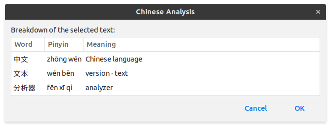

# Chinese Test Analyzer (中文文本分析器)
A basic utility that displays an analysis (word segmentation, pinyin, meaning) of any selected Chinese text.

Note: This is a toy project. I've only tested it on my computer (Ubuntu 20.04). Send any bugs to `bug.report@samuelj.li`.

## Requirements
This project requires `zenity` and `xclip` to interface with GTK,
as well as the following packages on Python 3.6 or higher:
- requests
- g2pc

## Tips
This is my current setup:
- Have the daemon (`daemon.py`) run on startup.
- Bind `shortcut.sh` to a keyboard shortcut.
This allows quick analysis of whatever text is currently selected.
